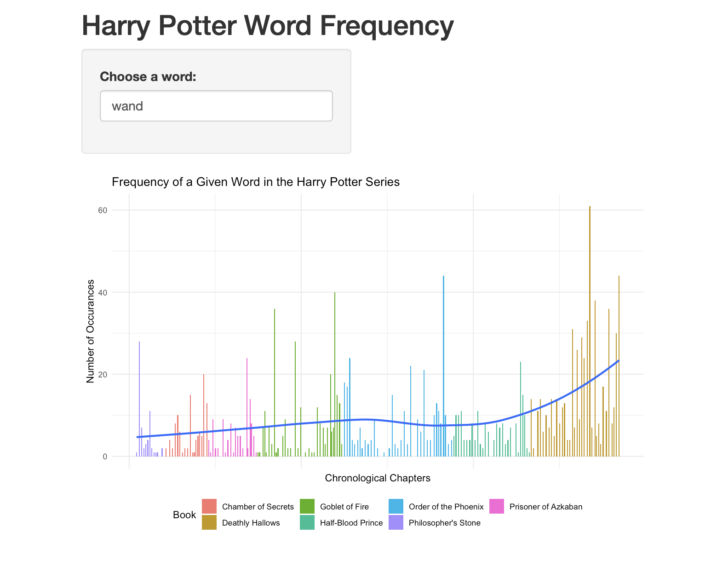

```{r setup, include=FALSE}
# load packages
library(devtools)
library(kableExtra)
library(knitr)
library(tidyverse)      
library(stringr)        
library(tidytext)
library(dplyr)
library(reshape2)
library(ggplot2)
library(RColorBrewer)
library(wordcloud)
library(topicmodels)
library(textdata)


# set code chunk defaults
knitr::opts_chunk$set(tidy = F, # display code as typed
                      size = "small", # slightly smaller code font
                      message = FALSE,
                      warning = FALSE,
                      comment = "\t") 

# set black & white default plot theme 
theme_set(theme_classic())

# improve digit and NA display 
options(scipen = 1, knitr.kable.NA = '')
```

# Introduction

Have you ever read a book series that spanned almost a decade and wondered how the books developed over this time period? Is there a visible change in the series? For this project, we will use text analysis skills to explore the Harry Potter franchise. We will be using text analysis because text analysis is a relatively large field that we only briefly touched upon. There are many different applications of text analysis in today's rapidly growing media landscape due to the increase of text content that is being put into the world. In fact, text analysis is an active research topic which has many applications in a variety of industries. This project will demonstrate some basic as well as some more advanced utilizations of text analysis. We chose to use the Harry Potter franchise for this purpose because it is a series that many young adults are familiar with which makes the analysis more interesting for the audience. For any unfamiliar with the series, it is a series of seven fantasy books written by J.K. Rowling about a young wizard navigating a world of magic with his friends as they face danger and the perils of growing up. As discussed above, we will be analyzing all seven books in the Harry Potter franchise. Specifically, we want to look into a few different aspects of these books:

1. How has the word choice evolved over the series of the books?

2. How has the tone of the books changed?

3. Has the author's writing style also changed throughout the time writing this franchise?

4. Without knowing the books beforehand, can we classify every chapter to its corresponding book? (Classification)

5. What are the common themes and topics that are prevalent in each book?


\newpage
# Data

Our data are the Harry Potter novels. The data source that we will be using for this project is the R package `bradleyboehmke/harrypotter` which has been used in the community for various educational purposes, so we will also be using this package. This package contains the Harry Potter novels that we are able to import into R once we install the package.Bradley Boehmke was the person who collected all seven books in the Harry Potter series by scraping the books from an a website that displayed the books. The package was created in 2016 so we assume that he collected the data in 2016. We chose to use the `harrypotter` package because it was created specifically to analyze the Harry Potter books, which is our topic of interest. From the package, the data were separated by book and contained the whole book in text format.

In order to prepare the data for our visuals, we had to perform some initial wrangling. This proved to be rather challenging as we not only had to remove the stopwords, we also had to identify and remove some high frequency words that don't add any value to the analysis. For instance, since the novels have story lines, they contain many names over and over again. However, this doesn't add any insight to our analysis, so we removed many of the common names in the books. For example, in the wrangling below, we removed a number of names that appeared frequently and across many books. We did keep certain names in such as "Gilderoy Lockhart" because he only significantly appears in "The Chamber of Secrets." 

Below is part of wrangling code that we think is new and other peers should see. There are two major parts: The first half takes all seven books, which are arrays in which each value in the array is a chapter, and tokenizes each chapter into words. Although we have seen this in class, we think the integration of a for-loop and the new use of an index make this code notable. The second half wrangles the data into a format that is compatible and friendly with the `cast_dtm()` function from the `topicmodel` package. We also want to show readers the common words that we decided to remove since it would give them a clear sense of why some words are not in the analysis. 

```{r Notable wrangling code, eval=FALSE}
# popular names that we removed for some of the analysis
pop_names <- c("harry", "potter", "hermione", "ron", "dumbledore", "hagrid",
               "snape", "malfoy", "voldemort", "vernon", "weasley", "dudley",
               "lupin", "sirius", "harry's", "umbridge", "mcgonagall", 
               "dobby", "aunt", "professor", "madam", "uncle", "madame", "rita")


series <- tibble()
for(i in seq_along(titles)) {
  temp <- tibble(chapter = seq_along(books[[i]]),
                 text = books[[i]]) %>%
    unnest_tokens(token = "words", output = word, input = text) %>%
    # we tokenize each chapter into words
    mutate(book = titles[i]) %>%
    select(book, everything())
  series <- rbind(series, temp)
}
# set factor to keep books in order 
series$book <- factor(series$book, levels = rev(titles))

# wrangling for LDA
`%notin%` <- Negate(`%in%`)
# Create word_counts data frame, aggregating word count for each chapter for 
# all books
word_counts <- series %>%
  unite(document, book, chapter) %>%
  anti_join(stop_words) %>%
  count(document, word, sort = TRUE) %>%
  filter(word %notin% pop_words)
```

The rest of our wrangling is contained in a separate wrangling file "wrangling.R". If a reader wants to follow up on our work, we have attached a link to bradleyboehmke’s git repository in our References section.


\newpage
# Methods

The first visualization that we did was a creating bigram word cloud that contained the top 10 words from each of the books and the overall series. We accomplished this by extracting bigrams from the novel instead of singular words and then cleaning the bigrams up by removing the stop words and the popular names. From this, we were able to generate word clouds.

Next, we created a graphic to show how the tone of the books has changed over the franchise. We used the BING lexicon to accomplish this. The BING lexicon characterizes words as either being positive or negative. We matched the words that are contained in the lexicon and then removed the words that were not contained. Thus, words without any sentiment value were discarded. Stop words were also removed. In order to create an index on which to scale the sentiment, we formed groups of 100 words and found the aggregate total of the group (number of positive words minus the number of negative words). Then we divided this number by 100 in order to scale the range of sentiment between negative one and one. Some of this code is shown below although the rest of it is contained within the wrangling file. 

```{r, eval = FALSE}
# remove stop words
sentiment <- series %>%
  anti_join(stop_words) 

lexicon <- get_sentiments("bing")

# join the two datasets and create the score for each chunk
sentiment_analysis <- sentiment %>%
  inner_join(lexicon, by = "word") %>%
  mutate(id = 1:n(), index = id %/% 100) %>%
  count(book, index = index, sentiment) %>%
  pivot_wider(names_from = sentiment, values_from = n, values_fill = 0) %>% 
  mutate(sentiment = (positive - negative)/100, 
         book = factor(book, levels = titles)) %>%
  arrange(index)

# calculate the proportion of words that were included in this analysis
sentiment_lexicon <- sentiment %>%
  inner_join(lexicon, by = "word")
nrow(sentiment_lexicon)/nrow(sentiment)


```

The visual was created using stacked bar plots so that we can see the change over time using color. As we can see, the later books have a larger number of words, so there are more 100-word chunks. However, we use the same bar to represent the whole book to easier depict the changes in tone at the start and end of each book. 

We also created a shiny app in which the user is able to able to search for any word and see how many times the word appears over the franchise and where. As shown below, each bar depicts a different chapter from the novels with the frequency being the number of times that the chose word appears in that chapter. A trend line was included to help visualize the patterns of specific words. The bars are arranged starting with the first chapter of the first book and ending with the last chapter of the last book. These initial visualizations will help us answer the first three of our questions of interest.

To address questions 4 and 5, we needed to go beyond: We implemented a model of unsupervised learning into our text analysis. Specifically, we used LDA (Latent Dirichlet Allocation), which is a very popular method of unsupervised learning, multiple classification of documents. Without going into too much detail, unsupervised learning is essentially "given many exploratory variables X's, let the model find the response variable Y". This is different from supervised learning, where we are given both X's and Y, which allows us to make interpretations like "a 1 degree increase in temperature is expected to increase ice cream sales by $10". LDA is similar to clustering on numeric data. LDA takes a collection of documents, in this case chapters, and converts it into a collection of words. Then, it will calculate and adjust the probability of every word in that collection being in a specific topic. Of course, as a model, LDA has its own assumptions, and the most notable one is that order of words and grammatical role are not considered: It treats each word as an individual to do the analysis. In this specific context, LDA helped us do two things: Classification and Genre-Per-Book.

Initially, we wanted to use this method of topic modeling to classify different topics/themes within a book. In this case, that means performing LDA on each Harry Potter book, and repeating that process seven times. However, during our self-researching period, we realized that LDA can also be used (and might be better used) to classify underlying topics over a corpus. Therefore, we also ran LDA on all seven books at once to see if it can correctly classify those books.

Regarding how we went beyond: First of all, we taught ourselves the basic concept of LDA (the 3 links we studied from are listed in the References section). Then, we tried to find an R package that can be used to perform topic modeling. We found 2 functional and community-approved packages: `topicmodels` and `lda`, and we decided to use the former because it is more up to date and there is a vignette on how to use it. Lastly, as an attempt to solidify our understanding of LDA, we read through 3 scientific papers (also listed in the "References" section). However, it appeared that we aren’t well-trained enough to comprehend everything written in those papers. Therefore, we deferred our goal of understanding how topic modeling works to a later time, and focused on knowing how to execute the functions and finish one cycle of analysis.

Below are the codes that we have decided to show since they include many of the new concepts.

```{r, eval=FALSE}
chapters_dtm <- word_counts %>%
  cast_dtm(document, word, n)
```

This chunk takes a data frame and turn it into a document-term matrix (hence `cast_dtm`), the only format that is compatible to the function `lda()` from this package. Without going into too much detail, a document-term matrix has rows as unique documents and columns as unique words. So, if a word from document 1 doesn't appear in document 2, the corresponding entry will be empty.

```{r, eval=FALSE}
chapters_lda <- LDA(chapters_dtm, k = 7, control = list(seed = 8))
```

Essentially, the function `LDA()` does all the heavy lifting, and is the most important line of all the LDA analysis. It takes a document-term matrix, the number of topics that a user pre-decides, and a seed to guarantee reproducibility. Then, we can call other functions to make sense of this output.

```{r, eval=FALSE}
chapter_topics <- tidy(chapters_lda, matrix = "beta")
```

This line examines the per-topic-per-word probabilities. In other words, it calculates the probability of a term being generated from a specific topic.

```{r, eval=FALSE}
chapters_gamma <- tidy(chapters_lda, matrix = "gamma")
```

This line examines the per-document classification. In other words, it estimates the proportion of words from a document that are generated from a specific topic


The 4 chunks above are the general framework of a LDA analysis. Of course, we used other visualizations to enhance our understanding, but we believe that our peers already know how to do the unmentioned wranglings and visualizations.

If the readers want to explore Latent Dirichlet Allocation further, they can find all the resources that we used in the References section.


\newpage
# Results

### Bigram Cloud
From the bigram clouds below, we are able to see the most popular bigrams for each of the books. We are able to see that each book has popular bigrams that are specific to the book as well as bigrams that are contained in other books. For example, we can see that the bigram, "Triwizard Tournament" is specific to "The Goblet of Fire", but the bigram, "Death Eaters" is contained in multiple of the word clouds (Goblet of Fire, Order of the Phoenix, Half-Blood Prince, and Deathly Hallows). By looking at the word cloud for bigrams that are popular over the whole series we are able to see many of the bigrams that occur in multiple words clouds. Along with "Death Eaters" are bigrams such as "Invisibility Cloak" or "Daily Prophet." It is interesting to see some of the bigrams that are important to each of the novels and how there are underlying elements that stay constant through the series.

```{r wordcloud, echo = FALSE}
no_names_bigrams <- read_csv("data/no_names_bigrams.csv")

# create colors
mypal <- brewer.pal(8, "Dark2")

set.seed(18)

# create a wordcloud function that takes input of book and generates cloud
make_a_wordcloud <- function(what_book) {
data <- no_names_bigrams %>%
  filter(book == what_book) %>%
  with(wordcloud(
    words = bigram,
    freq = n,
    min.freq = 4,
    max.words = 10,
    random.order = TRUE,
    scale = c(1.5,0.3),
    rot.per = 0,
    colors = mypal,
    family = "sans"
  ))
text(.5,.95, labels = what_book)
}

par(mfrow = c(3,3), mar = c(0,0,0,0), oma = c(0,0,0,0)) 
make_a_wordcloud("Philosopher's Stone")
make_a_wordcloud("Chamber of Secrets")
make_a_wordcloud("Prisoner of Azkaban")
make_a_wordcloud("Goblet of Fire")
make_a_wordcloud("Order of the Phoenix")
make_a_wordcloud("Half-Blood Prince")
make_a_wordcloud("Deathly Hallows")

# create an overall series wordcloud
data <- no_names_bigrams %>%
  group_by(bigram) %>%
  summarize(n = sum(n)) %>%
  with(wordcloud(
    words = bigram,
    freq = n,
    min.freq = 4,
    max.words = 10,
    random.order = TRUE,
    scale = c(1.45,0.2),
    rot.per = 0,
    colors = mypal,
    family = "sans"
  ))
text(.5,.95, labels = "All Books")

```

### Sentiment Analysis
From our sentiment analysis below, we are able to see that overall, the general sentiment of the series ranges from neutral to fairly negative. As described above, the books tend to have a larger number of words as the series progresses so there are a greater number of "chunks" that make up each book. For most of the books, we can see that the beginning and the end of each book are relatively neutral while the middle of the books being made up of negative and neutral sections. For example, in the "Half-Blood Prince," there are patches of neutral sentiment and negative sentiment that are interwoven until there is group of chunks near the end that have a greatly negative sentiment score. From this visual, it appears that the tone of the books appears to stay fairly consistent through the series.

```{r sentiment analysis, echo = FALSE}
titles <- c("Philosopher's Stone", "Chamber of Secrets", "Prisoner of Azkaban",
              "Goblet of Fire", "Order of the Phoenix", "Half-Blood Prince",
              "Deathly Hallows")

sentiment_analysis <- read_csv("data/sentiment_analysis.csv") %>%
  mutate(book = factor(book, levels = titles)) 

# create the plot 
ggplot(sentiment_analysis, aes(x = index, y = 1)) +
  geom_col(aes(color = sentiment, fill = sentiment)) + 
  scale_color_gradient(limits = c(-1, 1), low = "red",high = "green") +
  scale_fill_gradient(limits = c(-1, 1), low = "red",high = "green") + 
  facet_wrap(~book, scales = "free_x", ncol = 1) + 
  theme_void() + 
  labs(title = "Sentiment Analysis of Each Book",
       fill = "Sentiment Score", color = "Sentiment Score") +
  theme(legend.position = "bottom")
```

### Shiny App
From the Shiny App (which can be found at the following link: https://r.amherst.edu/apps/jpapagelis24/final-project231/), we are able to see how the trend of a certain word appears in the series. Since this aspect of the project is user-input, the conclusions that can be taken from it may differ. However, when we use the word, "wand" (since the book \emph{is} about magic), it appears that there is an upward trend in the use of the word per chapter. This can be done for any word that the user chooses. 


```{r, out.width = '75%', echo = FALSE}

```

### LDA
For the Latent Dirichlet Allocation classification, we found that the model, in both cases, had trouble finding very distinct topics. Specifically, for our first analysis, where we want to see if the model can successfully classify a chapter (document) to its corresponding book (topic), we saw that some words are dominantly common among all topics:

```{r read csv, include = FALSE}
#df for all books
word_counts <- read_csv("data/word_counts.csv")
```

```{r make LDA data set, include = FALSE}
chapters_dtm <- word_counts %>%
  cast_dtm(document, word, n)

chapters_dtm
```

```{r use lda function to create model, cache=TRUE, include = FALSE}
#Here, we chose to find 7 topics
chapters_lda <- LDA(chapters_dtm, k = 7, control = list(seed = 8))

chapters_lda
```


```{r examing per-topic-per-word probabilities, include = FALSE}
#Probability of that term being generated from that topic
chapter_topics <- tidy(chapters_lda, matrix = "beta")

chapter_topics
```

```{r top 5 terms of each topic, include = FALSE}
top_terms <- chapter_topics %>%
  group_by(topic) %>%
  slice_max(beta, n = 5) %>%
  ungroup() %>%
  arrange(topic, -beta)

top_terms
```

```{r top terms visualization, echo = FALSE, fig.height = 4, fig.width = 6}
top_terms %>%
  mutate(term = reorder_within(term, beta, topic)) %>%
  ggplot(aes(beta, term, fill = factor(topic))) +
  geom_col(show.legend = FALSE) +
  facet_wrap(~ topic, scales = "free") +
  scale_y_reordered() + 
  labs(title = "Top 5 Common Terms within each Topic", y = "Terms", x = "Probability of being Generated from each Topic")
```


For instance, the word “looked” is consistently in the top 5 most common words among all seven topics. Furthermore, it is the most common word for topics 4, 5, and 7. This implies that the topics are not strongly disjointed. As a consequence, the model couldn’t classify the books correctly. This will be shown in a confusion matrix below.


Before doing the analysis, we speculated that the "academic" theme will show up in the LDA analysis since the franchise's setting is in a magical school. Before addressing this question, we would like to emphasize that the only factor we can control is the number of topics. If we say we want 5 topics, the model will give us back 5 topics as requested. LDA, however, doesn't have the ability to "name" the topics itself, so the act of "classifying" the topics are done by us humans. Upon a more detailed examination of the top 5 common terms within each topic, we came to the conclusion that the "academic" theme is not among the 7 topics. Or, to be more accurate, the "academic" theme is not strong enough to appear in the 7 clusters of topics. For instance, one can argue that the word "professor" might be an indication of an "academic" theme. However, "professor" appeared as one of the most common terms in multiple topics, specifically 3,5, and 7. This implies that "professor" signifying the "academic" theme is unlikely.

```{r per-document classification, include = FALSE}
#Check notes. Might have to modify this step.
chapters_gamma <- tidy(chapters_lda, matrix = "gamma")

#Estimated proportion of words from that document that are generated from that topic
chapters_gamma
```

```{r per-document-per-topic probability for each document, include = FALSE}
chapters_gamma <- chapters_gamma %>%
  separate(document, c("title", "chapter"), sep = "_", convert = TRUE)

chapters_gamma <- chapters_gamma %>%
  arrange(chapter)

chapters_gamma
```

```{r reorder title in order, include = FALSE}
chapters_gamma %>%
  mutate(title = reorder(title, gamma * topic)) %>%
  ggplot(aes(factor(topic), gamma)) + 
  geom_boxplot() +
  facet_wrap(~ title) +
  labs(x = "topic", y = expression(gamma))
  
```

```{r chapter classification, include = FALSE}
chapter_classification <- chapters_gamma %>%
  group_by(title, chapter) %>%
  slice_max(gamma) %>%
  ungroup()

chapter_classification
```

```{r compare each chapter to the most common topic for each book, include = FALSE}
book_topics <- chapter_classification %>%
  count(title, topic) %>%
  group_by(title) %>%
  slice_max(n, n = 1) %>%
  ungroup() %>%
  transmute(consensus = title, topic)

chapter_classification %>%
  inner_join(book_topics, by = "topic") %>%
  filter(title != consensus)
```


```{r assign each word in each document to a topic, include = FALSE}
assignments <- augment(chapters_lda, data = chapters_dtm)
assignments
```


```{r which words were incorrectly classified, include = FALSE}
assignments <- assignments %>%
  separate(document, c("title", "chapter"), sep = "_", convert = TRUE) %>%
  inner_join(book_topics, by = c(".topic" = "topic")) %>%
  distinct()

assignments
```

```{r confusion matrix, echo = FALSE, fig.height = 4, fig.width = 6}
#showing how often words from one book were assigned to another
library(scales)

assignments %>%
  count(title, consensus, wt = count) %>%
  mutate(across(c(title, consensus), ~str_wrap(., 20))) %>%
  group_by(title) %>%
  mutate(percent = n / sum(n)) %>%
  ggplot(aes(consensus, title, fill = percent)) +
  geom_tile() +
  scale_fill_gradient2(high = "darkred", label = percent_format()) +
  theme_minimal() +
  theme(axis.text.x = element_text(angle = 90, hjust = 1),
        panel.grid = element_blank()) +
  labs(title = "Confusion Matrix", x = "Book the Words Were Assigned To",
       y = "Book the Words Came From",
       fill = "% of Assignments")
```

```{r most commonly mistaken words, include = FALSE}
# is this needed? not sure??? --> Only needed for internal analysis. Not necessary to make visualizations and present.
wrong_words <- assignments %>%
  filter(title != consensus)

wrong_words

wrong_words %>%
  count(title, consensus, term, wt = count) %>%
  ungroup() %>%
  arrange(desc(n))
```

Before going into the analysis of this confusion matrix, we would like to explain how we constructed this matrix. We first created a data frame (which is not shown as one of the final products) to store the necessary information. That data frame has 6 columns: book, chapter, term, term frequency in that chapter, the topic LDA thinks that term belongs to, and the book LDA thinks that term belongs to. So row can be interpreted as: We take a word from chapter 1 of book A, and LDA classified that word as coming from book C. This is essentially how we built our confusion matrix. We plot the "original/correct" word assignments on the y-axis, and the "LDA thinks" word assignments on the x-axis.

Here, we can see that at best, the model assigned words coming from Deathly Hallows to the Deathly Hallows topic (implying that the identification is correct) 60% of the time, which is significantly better than random guessing. On the other extreme end of the spectrum, the model assigned words from Goblet of Fire to the Goblet of Fire topic only 20% of the time. One could argue that this is still better than randomly guessing (1/7 chance of getting the correct answer), but we think this means that the model is not very helpful in this setting.


For our second analysis, where we want to find the common themes/topics within each book, we decided to find 3 topics. We chose 3 rather than any other number because we think that it is a reasonable number of topics to discover. At that time we didn't know any metric to evaluate the optimal number of topics (something similar to the elbow plot for k-means clustering), so we picked 3 as a starting point. We did try other numbers of topics, in particular 4 and 5, but we didn't see any significant difference among the options. In other words, they all had the same pattern, which we will discuss below. Hence, for the sake of simplicity, we ended up with 3 topics. Take “Deathly Hallows” as an example:

```{r read csv for second analysis, include = FALSE}
#df for Philosopher's stone
philosopher <- read_csv("data/philosopher_word_counts.csv")

#df for Chamber of Secrets
chamber <- read_csv("data/chamber_word_counts.csv")

#df for Prisoner of Azkaban
prisoner <- read_csv("data/prisoner_word_counts.csv")

#df for Goblet of Fire
goblet <- read_csv("data/goblet_word_counts.csv")

#df for Order of the Phoenix
order <- read_csv("data/order_word_counts.csv")

#df for Half-Blood Prince
half <- read_csv("data/half_word_counts.csv")

#df for Deathly Hallows
deathly <- read_csv("data/deathly_word_counts.csv")
```

```{r make a list to loop through, include =  FALSE}
books <- c(philosopher, chamber, prisoner, goblet, order, half, deathly)
```

```{r lda analysis, include = FALSE}
book_genre <- NULL

#Loop through each book
#Q: My loop is not running!
#book is only a 1:5406 vector, while I want it to be 3:5406 like the data frame
for (i in c(1,4,7,10,13,16,19)) {
#make LDA data set
chapters_dtm <- data.frame(books[i], books[i+1], books[i+2]) %>%
  cast_dtm(book, word, n)

#chapters_dtm

#use lda function to create model
chapters_lda <- LDA(chapters_dtm, k = 3, control = list(seed = 8))

#chapters_lda

#examing per-topic-per-word probabilities
#Probability of that term being generated from that topic
chapter_topics <- tidy(chapters_lda, matrix = "beta")

#chapter_topics

#top 5 terms of each topic
top_terms <- chapter_topics %>%
  group_by(topic) %>%
  slice_max(beta, n = 5) %>%
  ungroup() %>%
  arrange(topic, -beta)

#top_terms

#top terms visualization
visual_stone <- top_terms %>%
  mutate(term = reorder_within(term, beta, topic)) %>%
  ggplot(aes(beta, term, fill = factor(topic))) +
  geom_col(show.legend = FALSE) +
  facet_wrap(~ topic, scales = "free") +
  scale_y_reordered() +
  labs(title = "Common Themes within Deathly Hallows", y = "Most Common Terms within each Topic", x = "Probability of being Generated from each Topic")

#per-document classification
#Check notes. Might have to modify this step.
chapters_gamma <- tidy(chapters_lda, matrix = "gamma")

#Estimated proportion of words from that document that are generated from that topic
chapters_gamma

#Add the genre proportion to a new data frame to summarize
book_genre <- rbind(book_genre, chapters_gamma)
}

book_genre
```

```{r, echo = FALSE, fig.height = 4, fig.width = 8}
visual_stone
```

Again, we found that there are certain words that appear on multiple topics, implying that the topics are not dissimilar to each other, at least to the level that we desired. As a consequence, the model couldn’t find a clear, apparent topic for any book:

```{r pivot wider for better visualization, echo = FALSE}
#Rename for better understanding
book_genre <- book_genre %>%
  rename(proportion = gamma)

book_genre <- pivot_wider(book_genre, names_from = "topic", names_glue = "t{topic}_proportion", values_from = "proportion")

kable(book_genre, booktabs = TRUE)
```

Take Philosopher’s Stone. The model says that it is 33% topic 1, 33% topic 2, and 33% topic 3. We observed that this trend holds for all 7 books. Without even identifying and naming the topic (something us users must do; the model couldn’t do this), we conclude that there is not a dominant theme in each book.


\newpage
# Conclusion

Overall, we were able to roughly answer all of the questions that we had proposed although we do have some limitations to our analysis. In particular, our sentiment analysis is only as useful as the lexicon we use and although the BING lexicon worked fairly well, there were lots of words from the novel that were not included because they did not match any of the words in the lexicon. Overall, only about 13.05% of the words (excluding stop-words) had a sentiment value assigned to them so it is difficult to determine the effectiveness of this visual. With a larger and more specific lexicon, we could better analyze the sentiment as it varies through the novel with a greater variety and proportion of words being represented. We planned on doing a statistical test to see if there is a significant difference in the books, however we opted not to do this due to the limited lexicon not being very representative of the actual books. Additionally, the LDA analysis accomplishes this to a certain degree.

For the LDA, our biggest limitation is the nature of our data. Although topic modeling is a very popular method of multiple classification, our analysis serves to be an example of an edge case when the model may not produce absolute results: The Harry Potter franchise revolves around one main character, Harry Potter, so all 7 books are somewhat interconnected. Therefore, in a sense, some words are used repeatedly throughout the series. Therefore, if we look at a word that is used in all 7 books, we would not necessarily know which book this instance of the word belongs to. This is exactly what’s happening with the LDA model. With that being said, our analysis doesn’t undermine the prowess of Latent Dirichlet Allocation: Given 4 very different books (example in the References section), the model correctly classified words almost 100% of the time.

We used the Harry Potter books as a way to demonstrate text analysis on a series and this method could be used to analyze any series or group of books. We believe that our work can be generalized. That is, users can input an infinite number of books to form a corpus, and the model would still be able to do the analysis. Furthermore, our work can be extended with more computational power: As the number of topics increases, the running time also increases exponentially. A way to improve our study would be to pick unrelated data instead of books that are sequels of another. 


\newpage 
# References

Below are all the resources that we used to realize this ambitious project:

### R package for data: `bradleyboehmke/harrypotter`

https://github.com/bradleyboehmke/harrypotter


### R package for LDA: topicmodels

https://cran.r-project.org/web/packages/topicmodels/vignettes/topicmodels.pdf


### Text Analysis Guide

https://www.tidytextmining.com/index.html


### LDA concept guide:

https://towardsdatascience.com/latent-dirichlet-allocation-lda-9d1cd064ffa2

http://blog.echen.me/2011/08/22/introduction-to-latent-dirichlet-allocation/

https://en.wikipedia.org/wiki/Latent_Dirichlet_allocation


### LDA Example: 

https://www.tidytextmining.com/topicmodeling.html


### Machine Learning papers:

Blei D.M., Ng A.Y., Jordan M.I. (2003). Latent Dirichlet Allocation. Journal of Machine Learning Research, 3, 993–1022.

Phan X.H., Nguyen L.M., Horguchi S. (2008). Learning to Classify Short and Sparse Text & Web with Hidden Topics from Large-scale Data Collections. In Proceedings of the 17th International World Wide Web Conference (WWW 2008), pages 91–100, Beijing, China.

Lu, B., Ott, M., Cardie, C., Tsou, B.K. (2011). Multi-aspect Sentiment Analysis with Topic Models. In Proceedings of the 2011 IEEE 11th International Conference on Data Mining Workshops, pages 81–88. 